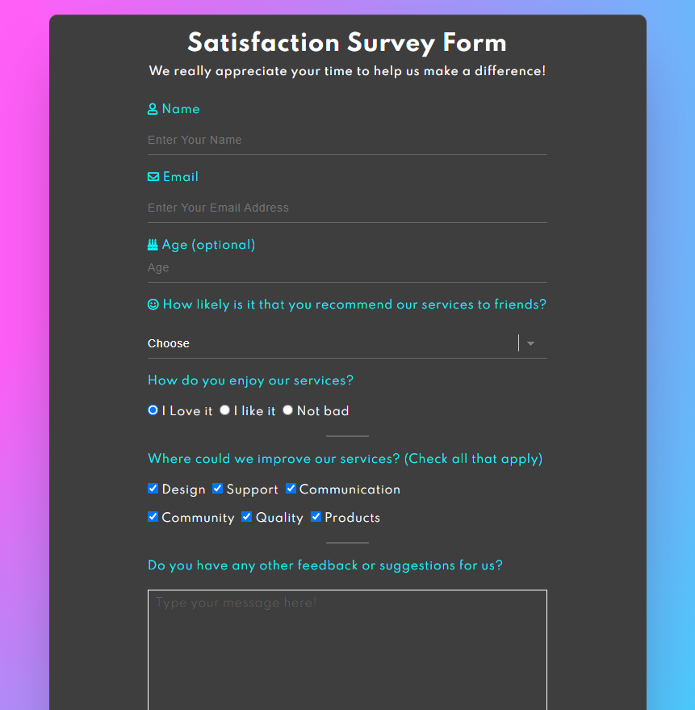

# freeCodeCamp Challenge - Build a Survey Form

## The Challenge

This challenge has been pretty awesome to do. The goal was to create a survey form. I decided to make it look my own way. This challenge was to create a survey form similar to this: https://codepen.io/freeCodeCamp/full/VPaoNP.

### My choice

I designed the complete survey from by myself and tried to be as creative as possible. It is not perfect but I think it's pretty decent for quite a css beginner.

This is the end result:

### Built with

- Semantic HTML5 markup
- CSS custom properties
- Flexbox

## Author

- Frontend Mentor - [@mitch-webdev](https://www.frontendmentor.io/profile/mitch-webdev)
- GitHub - [mitch-webdev](https://github.com/mitch-webdev)